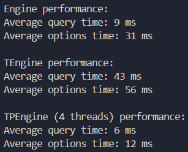

# cli_search

Search a set of lines for matches to a query. Used a trie data structure to
store the lines and then using a single-threaded, multi-threaded and
threadpooling approach to traverse the trie.

Query: traversing the search trie for matches to the query. 
Options: traversing the search trie to build the list of options still active.

Engines:

- Engine: single threaded engine.
- TEngine: multi-threaded engine with thread being spawn within the query and option listing.
- TPEngine: multi-threaded engine with thread being spawn up front within a threadpool.

NOTES:

Query runs faster than Options since it does not traverse the search trie further if there is a match. 
In TEngine, the cost of spawning threads impacts the performance of the engine,
resulting in the worst time. 
In TPEngine, the cost of spawning threads are done on creating the engine,
thus multithreading and occur without the cost of spawning threads.
